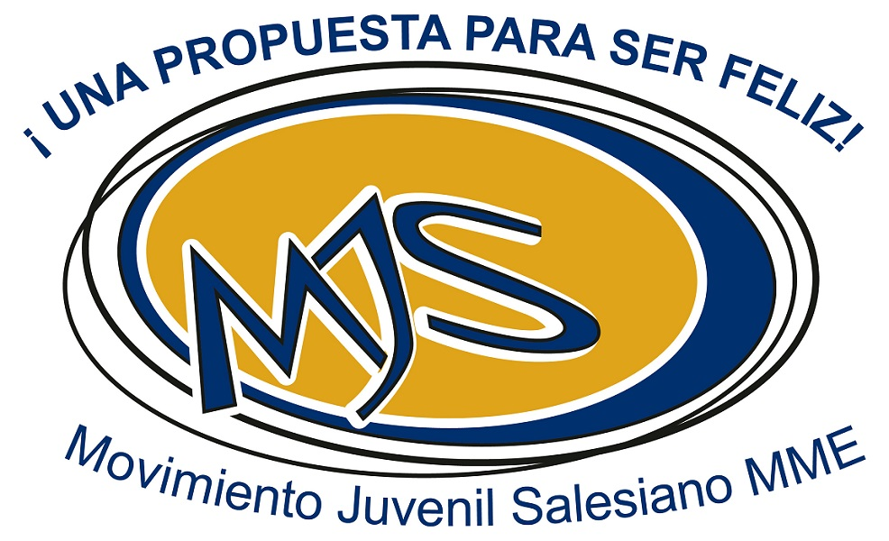

 

# Bienvenido al Repositorio del Movimiento Juvenil Salesiano MME

Aqui encontraras los archivos de la [Escuela de Animadores](https://mjsmme.gnomio.com/) 

## Módulo 1: Ser Animador 

1. [Realidad de Adolescentes y Jóvenes](doc/Escuela_de_Animadores/1_Ser_Animador/1_1_Realidad_de_Adolescentes_y_Jovenes.pdf)
2. [La persona](doc/Escuela_de_Animadores/1_Ser_Animador/1_2_La_persona.pdf)
3. [La Animación](doc/Escuela_de_Animadores/1_Ser_Animador/1_3_Animacion.pdf)
4. [Liderazgo de Jesús](doc/Escuela_de_Animadores/1_Ser_Animador/1_4_Liderazgo_de_Jesus.pdf)
5. [Antropología Filosófica](doc/Escuela_de_Animadores/1_Ser_Animador/1_5_Antropologia_Filosofica.pdf)
6. [Acompañamiento Personal](doc/Escuela_de_Animadores/1_Ser_Animador/1_6_Acompañamiento_Personal.pdf) - [Anexos](doc/Escuela_de_Animadores/1_Ser_Animador/1_6_Situacion_del_Acompañamiento_en_la_Pastoral_Juvenil_Salesiana_Anexo.pdf)
7. [El Asesor y su Rol de Acompañamiento](doc/Escuela_de_Animadores/1_Ser_Animador/1_7_El_Asesor_y_su_Rol_de_Acompañamiento.pdf)

## Módulo 2: Herramientas 
1. [El grupo y sus dinámicas](doc/Escuela_de_Animadores/2_Herramientas/2_1_El_grupo_y_sus_dinamicas.pdf) - [Anexo](doc/Escuela_de_Animadores/2_Herramientas/2_1_El_grupo_y_sus_dinamicas_Anexo.pdf)
2. [Actividades propias de la Animación](doc/Escuela_de_Animadores/2_Herramientas/2_3_Actividades_Propias_de_la_Animacion.txt)
3. [Técnicas para el Manejo de Grupo](doc/Escuela_de_Animadores/2_Herramientas/2_3_Tecnicas_para_el_Manejo_de_Grupo.pdf) - [Anexo](doc/Escuela_de_Animadores/2_Herramientas/2_3_Manual_de_Tecnicas_Grupales_Anexo.pdf)
4. [El Juego, tipos y aplicación](doc/Escuela_de_Animadores/2_Herramientas/2_4_El_Juego_tipos_y_aplicacion.pdf)
5. [Cómo Animar a un grupo](doc/Escuela_de_Animadores/2_Herramientas/2_5_Como_Animar_a_un_grupo.pdf)
6. [Doctrina Social de la Iglesia](doc/Escuela_de_Animadores/2_Herramientas/2_6_Doctrina_Social_de_la_Iglesia.pdf)
7. [Tipos de Campamentos](doc/Escuela_de_Animadores/2_Herramientas/2_7_Tipos_de_Campamentos.pdf) - [Anexo](doc/Escuela_de_Animadores/2_Herramientas/2_7_Tipos_de_Campamentos_Anexo.pdf)

## Módulo 3: Espiritualidad Salesiana 
1. [Espiritualidad Cristiana](doc/Escuela_de_Animadores/3_Espiritualidad_Salesiana/3_1_Espiritualidad_Cristiana.pdf)
2. [Don Bosco con Dios](doc/Escuela_de_Animadores/3_Espiritualidad_Salesiana/3_2_Don_Bosco_con_Dios.pdf)
3. [Rasgos de la Espiritualidad de MM](doc/Escuela_de_Animadores/3_Espiritualidad_Salesiana/3_3_Rasgos_de_la_Espiritualidad_de_MM.pdf)
4. [Espiritualidad Juvenil Salesiana](doc/Escuela_de_Animadores/3_Espiritualidad_Salesiana/3_4_Espiritualidad_Juvenil_Salesiana.pdf)
5. La PJS y el acompañamiento [Tema](doc/Escuela_de_Animadores/3_Espiritualidad_Salesiana/3_5_La_PJS_y_el_acompañamiento_Tema.pdf) - [Ejercicio](doc/Escuela_de_Animadores/3_Espiritualidad_Salesiana/3_5_La_PJS_y_el_acompañamiento_Ejercicio.pdf) - [Anexo](doc/Escuela_de_Animadores/3_Espiritualidad_Salesiana/3_5_Acompañamiento_Personal_Material_de_Apoyo.pdf)
6. [Principios de la Doctrina Social de la Iglesia](doc/Escuela_de_Animadores/3_Espiritualidad_Salesiana/3_6_Principios_de_la_DSI.pdf)
7. [El acopañante](doc/Escuela_de_Animadores/3_Espiritualidad_Salesiana/3_7_El_Acompañante.pdf) - Anexos: [1](doc/Escuela_de_Animadores/3_Espiritualidad_Salesiana/3_7_El_Acompañante_Anexo_1.pdf) [2](doc/Escuela_de_Animadores/3_Espiritualidad_Salesiana/3_7_El_Acompañante_Anexo_2.pdf) [3](doc/Escuela_de_Animadores/3_Espiritualidad_Salesiana/3_7_El_Acompañante_Anexo_3.pdf)

## Módulo 4: Pedagogía Salesiana 
1. [Pedagogía Salesiana](doc/Escuela_de_Animadores/4_Pedagogia_Salesiana/4_1_Pedagogia_Salesiana.pdf)
2. [El Sistema Preventivo desde Valdocco](doc/Escuela_de_Animadores/4_Pedagogia_Salesiana/4_2_El_Sistema_Preventivo_desde_Valdocco.pdf) - [La Pedagogía de la fiesta](doc/Escuela_de_Animadores/4_Pedagogia_Salesiana/4_2_1_La_pedagogia_de_la_fiesta.pdf)
3. [La Pedagogía Salesiana desde Mornés](doc/Escuela_de_Animadores/4_Pedagogia_Salesiana/4_3_La_Pedagogia_Salesiana_desde_Mornes.pdf)
4. -
5. [Acompañamiento en Don Bosco](doc/Escuela_de_Animadores/4_Pedagogia_Salesiana/4_5_Acompanamiento_en_DB.pdf)
6. [Discernimiento](doc/Escuela_de_Animadores/4_Pedagogia_Salesiana/4_6_Discernimiento.pdf) - [Discernimiento Humano y Espiritual](doc/Escuela_de_Animadores/4_Pedagogia_Salesiana/4_6_1_Discernimiento_Humano_y_Espiritual.pdf)
7. [Empatía en el Acompañamiento](doc/Escuela_de_Animadores/4_Pedagogia_Salesiana/4_7_Empatia_en_el_acompañamiento.pdf)
8. [Confidencialidad en el Acompañamiento](doc/Escuela_de_Animadores/4_Pedagogia_Salesiana/4_8_Confidencialidad_en_el_acompañamiento.pdf)

## Módulo 5: Metodología Catequística 

1. [Psicología de los niños y adolescentes](Files/5_1_Psicologia.pdf)
2. [Pedagogía Divina](https://github.com/RicardoZamoraD/Movimiento_Juvenil_Salesiano_MME/blob/main/Files/5.2%20Pedagogia%20divina.pdf)
3. [Metodología Catequística](https://github.com/RicardoZamoraD/Movimiento_Juvenil_Salesiano_MME/blob/main/Files/5.3%20metodolog%C3%ACa%20catequistica.pdf)
4. Elaboración de un tema y darlo

## Módulo 6: Tiempo Libre 
